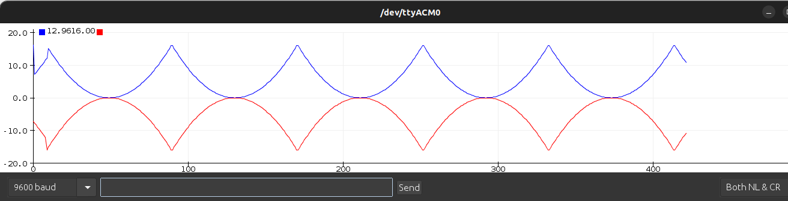

<!---
dev-ansh-r/dev-ansh-r is a ✨ special ✨ repository because its `README.md` (this file) appears on your GitHub profile.
You can click the Preview link to take a look at your changes.
--->
 
 
.svg)

<!--   my-ticker -->    

<!-- COntributions 
 -->

# 💫 Know More About me
🔭 *"Currently Obsessed with exploring the vast expanse of knowledge, unearthing precious pearls of wisdom and vanquishing the darkness of ignorance - I am the mighty Research Enthusiast!"* 😂😂.   👀 I’m interested in Science and Maths. 🤝 I’m looking to collaborate on IoT and Embedded Solutions. 🌱 I’m currently Pursuing an Engineering Degree or should I say, " I am currently decoding the laws of science".  💬 Ask me about **Stars**💫, Startups and Technology🤖.  ⚡ Fun fact, I sleep a lot. 
- This is how my sleep cycle looks like 😂😂😂....

## 🌐 Socials:
     

# 💻 Tech Stack:
                       	          

IoT protocols : HTTP, MQTT, AMQP, CoAP, LoRa, SPI, BLE, Zigbee, Thread, I2c, UART/USART .
Embedded Boards : AVR- Arduino.cc (UNO,MEGA,NANO,BLE SENSE), Esp (8266,32s), ARM- STM32 BL4, Raspberry Pi-4b, TI-CC2569.
Cloud Platforms : GCP, The Things Stack, thingsboard.io 
Operating Systems : Linux-Ubuntu,Raspbian | Windows.
CI/CD : Git, GitHub.

<!--   my-skils -->

| Stack                                        | Tools                                                                                                                                                                                                                                                                                                                                                                                                                                                                                                                                                                                                                                                                                                                                                                                                                                                                                                                                                                                                                                                                                                                                                                                                                                                                                                                                                                                                                                                                                                                                                                                                                                                                                                                                                                                                            |
|-------------------------------------------------|-----------------------------------------------------------------------------------------------------------------------------------------------------------------------------------------------------------------------------------------------------------------------------------------------------------------------------------------------------------------------------------------------------------------------------------------------------------------------------------------------------------------------------------------------------------------------------------------------------------------------------------------------------------------------------------------------------------------------------------------------------------------------------------------------------------------------------------------------------------------------------------------------------------------------------------------------------------------------------------------------------------------------------------------------------------------------------------------------------------------------------------------------------------------------------------------------------------------------------------------------------------------------------------------------------------------------------------------------------------------------------------------------------------------------------------------------------------------------------------------------------------------------------------------------------------------------------------------------------------------------------------------------------------------------------------------------------------------------------------------------------------------------------------------------------------------|
| **Language / IDE**                              |                                                                                                                                                                                                                                                                                                                                                                                                                                                                                                                                                                                                                                                                                                                                                                                                                                                                                                                                                                                                                                                                                                                                                                                                                                                                                                                                                                                                                                                                                               |
| **Domain Knownledge**                           |     [-01D277?style=flat&logoColor=white)](https://github.com/dev-ansh-r/dev-ansh-r)                                                                                                                                                                                                                                                                                                                                                                                                                                                                                                                                                                                                                                                                                                                                                                                                                                                                                                                                                                                                                                             |
| **IoT Operating Systems**                                     |                                                                                                                                                                                                                                                                                                                                                                                                                                                                                                                                                                                                                                                                                                                                                                                                                                                                                                                                                                                                                                                                                      |
| **CI / CD**                                     |                                                                                                                                                                                                                                                                                                                                                                                                                                                                                                                                                                                                                                                                                                                                                                                                                                                                                                                                                                                                                                                                                                                                                                                                                                                                                                                                                                                          |
| **Databases**                                   |                                                                                                                                                                                                                                                                                                                                                                                                                                                                                                                                                                                                                                                                                                                                                                                                                                                                                                                                                 |
| **OS**                                          |                                                                                                                                                                                                                                                                             |
| **Tools & Platform**                            |                                                                                                                                                                                                                                                                                                                                                                                                                                                                                                                                                                                                                                                                                                                                                                                                                                                                                                                                                                                                                                                                                                                                                                                                                                                                                                                                                                                              |

# 📊 GitHub Stats:
| .                                                                                                                                       | .                                                                                                                         |
|-----------------------------------------------------------------------------------------------------------------------------------------|---------------------------------------------------------------------------------------------------------------------------|
|  |  |